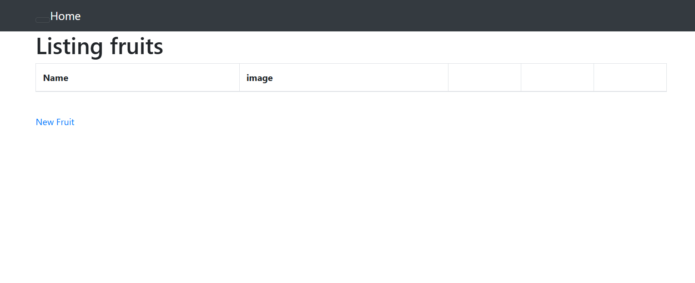
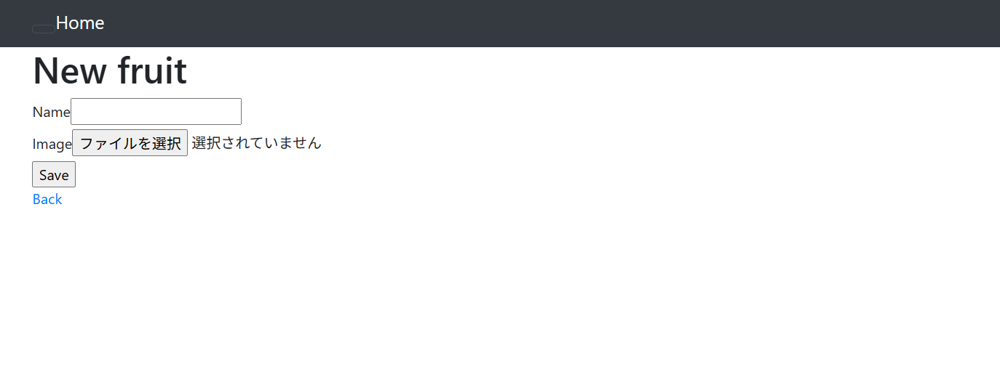
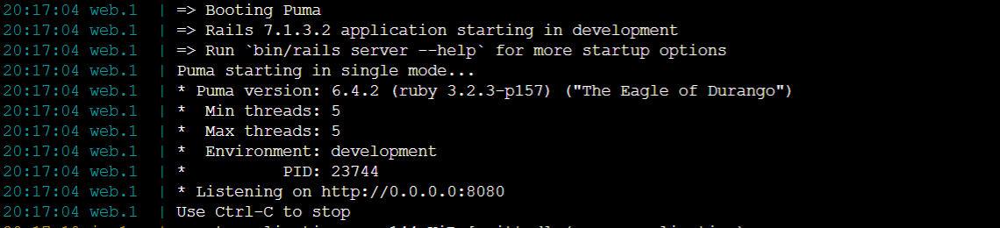
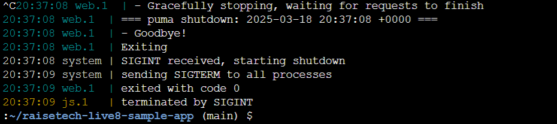
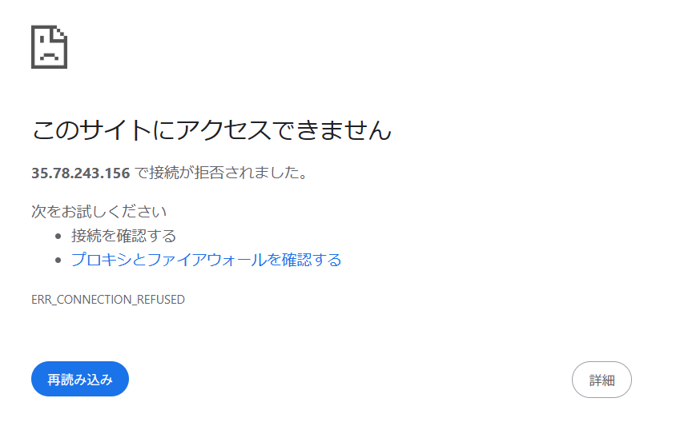
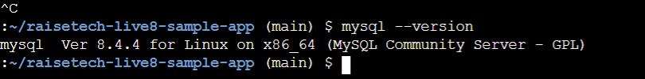
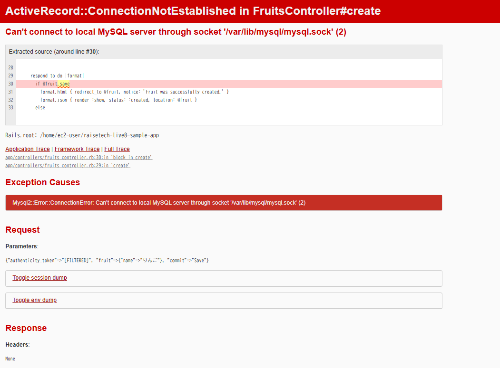
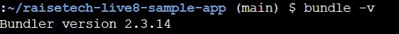

# lecture03

## アプリケーションの起動画面

  

## 1. APサーバーについて調べる

- 名前：Puma / バージョン：6.4.2  

- APサーバーを終了させた場合、引き続きアクセスできるか？  
⇒できない。  
  

## 2. DBサーバーについて調べる

- 名前：MySQL / バージョン：8.4.4  

- DBサーバーを終了させた場合、引き続きアクセスできるか？  
⇒できない。  

- Railsの構成管理ツールの名前は？  
⇒ Bundler  

## 本課題をとおして学んだこと

Cloud9/EC2インスタンスの仕様やできることの違い、ローカルPCから相対パスでの画像のアップロード⇒Markdownファイルへの埋め込みなど、つまづくポイントは多々あった。  
だいぶ時間を費やしてしまったものの、作業導線をしっかりと身につけることができた。
