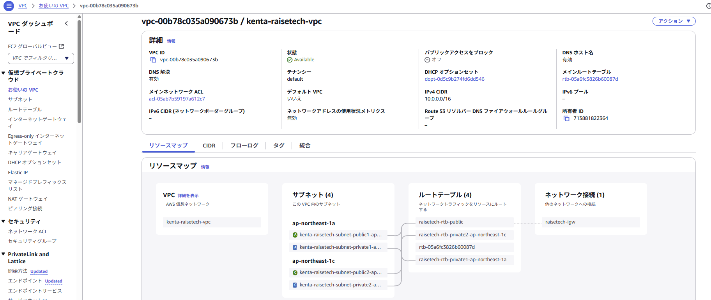
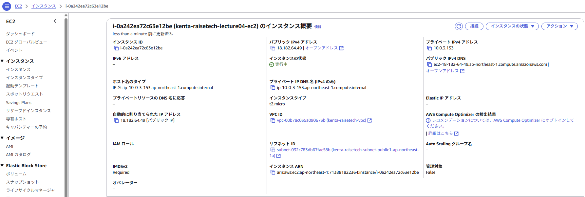
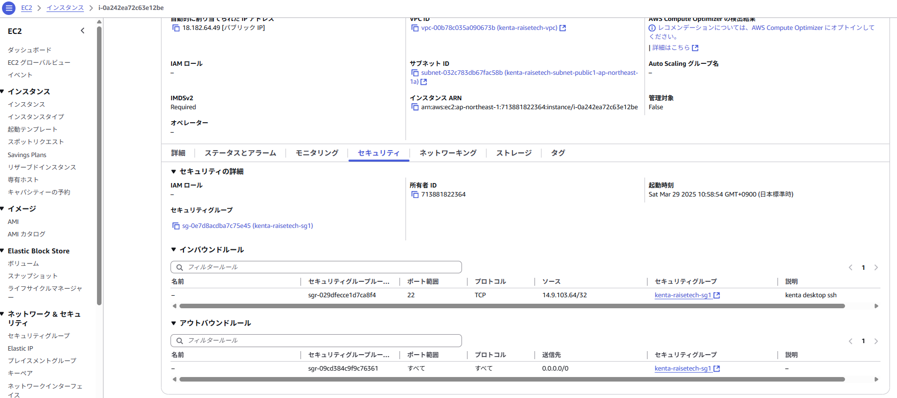
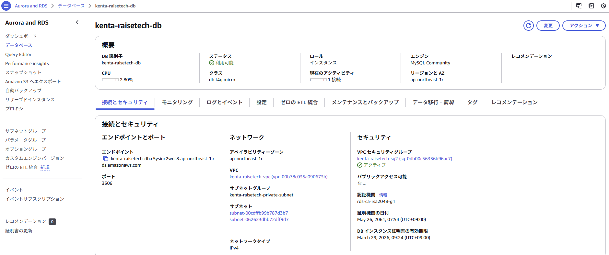
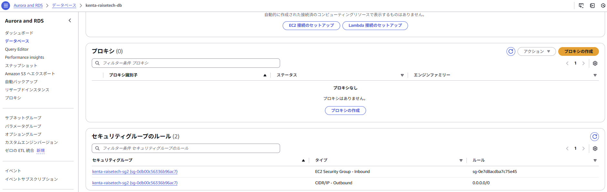
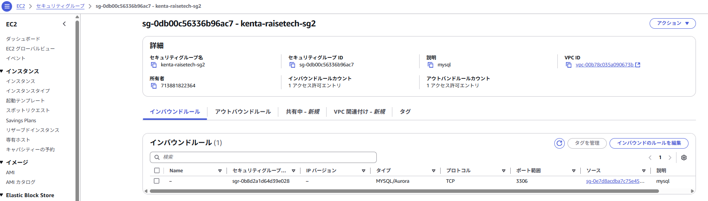
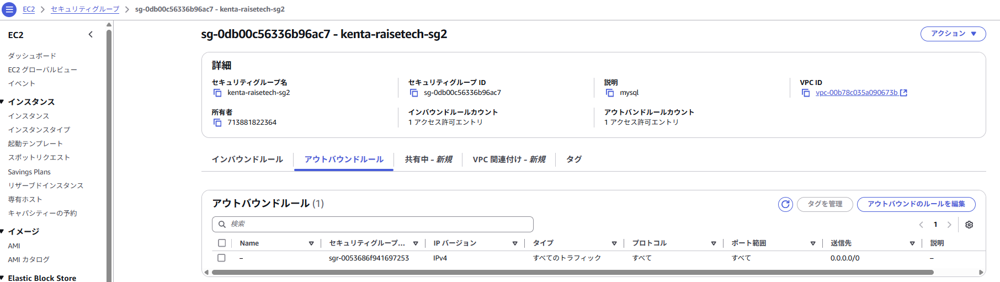
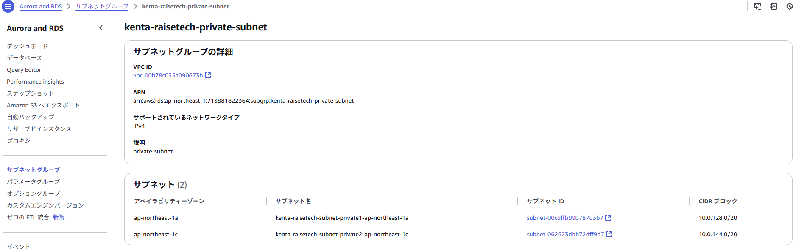
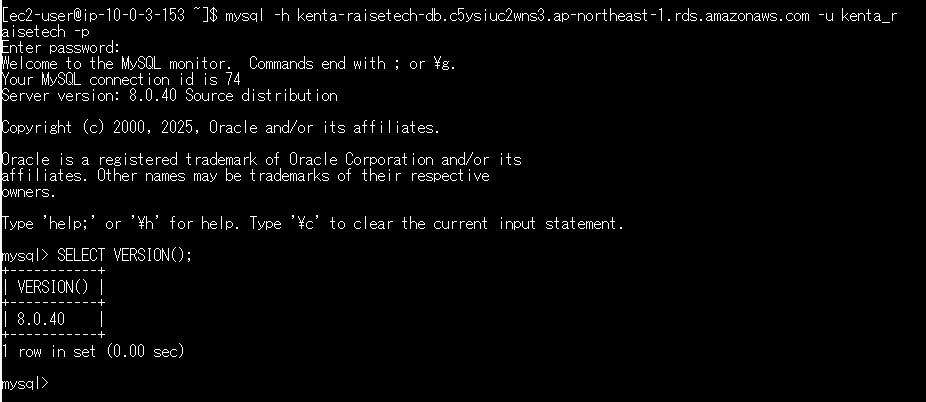

# lecture04

## 1. AWS上にVPCを新規作成

## 2. EC2の構築

- EC2セキュリティグループ / インババウンド＆アウトバウンドルール  

## 3. RDSの構築

- RDSセキュリティグループ：一覧  

- RDSセキュリティグループ / インバウンドルール  

- RDSセキュリティグループ / アウトバウンドルール  

- RDSサブネット  

## 4. EC2 ⇒ RDSの接続

